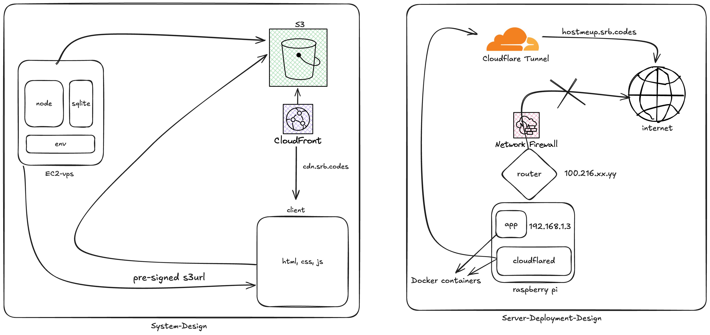

# HostMeUp

A simple file hosting service with user authentication and AWS S3 integration.

## System Design

## Features

- User authentication and authorization
- File upload with AWS S3 storage
- Pre-signed URLs for secure file access
- SQLite database for metadata storage
- Dockerized deployment

## Tech Stack

- **Backend**: Node.js, Express.js
- **Database**: SQLite
- **Storage**: AWS S3
- **Authentication**: JWT with bcrypt
- **Deployment**: Docker

## API Endpoints

- Authentication (signup/signin)
- File upload and management
- User dashboard

---

## Connect

Let's connect on X [@srbcode](https://x.com/srbcode)
